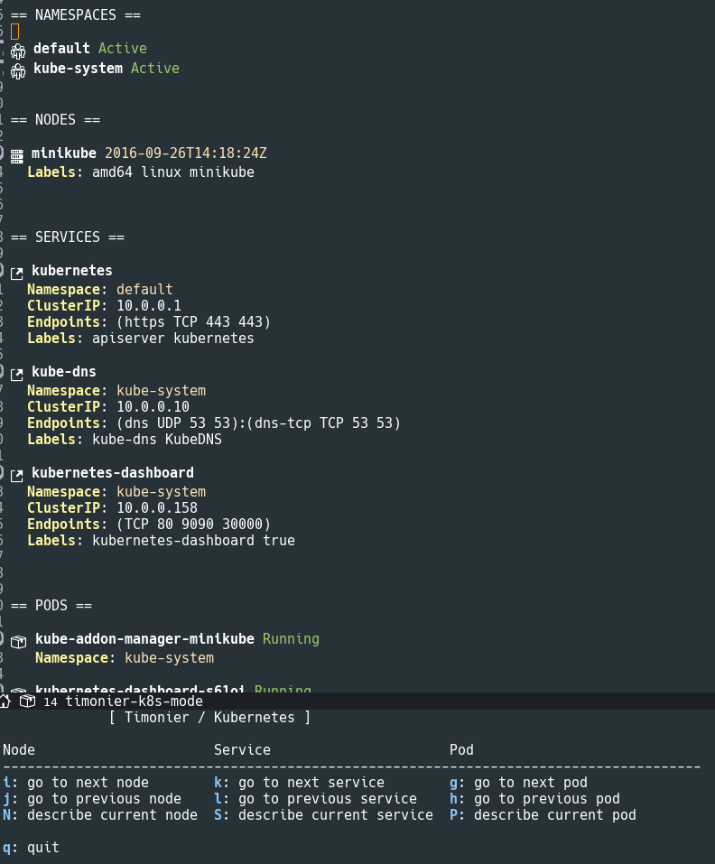

# Timonier

[](https://coveralls.io/r/nlamirault/timonier?branch=master)

Master :
* [](https://stable.melpa.org/#/timonier)
* [](https://circleci.com/gh/nlamirault/timonier/tree/master)

Develop:
* [](https://melpa.org/#/timonier)
* [](https://circleci.com/gh/nlamirault/timonier/tree/develop)

``timonier`` is an Emacs frontend for a [Kubernetes][] cluster.


## Installation

The recommended way to install ``timonier`` is via [MELPA][]:

    M-x package-install timonier

or [Cask][]:

	(depends-on "timonier")


## Usage

* Setup the Kubernetes proxy endpoint:

        (setq timonier-k8s-proxy "http://localhost:8001")

* Display the dashboard:

        M-x timonier-k8s

* In the buffer:

Launch the timonier menu using the key : <kbd>C-c C-k</kbd>

Keybinding           | Description
---------------------|------------------------------------------------------------
<kbd>g</kbd>         | go to the news pod
<kbd>h</kbd>         | go to the previous pod
<kbd>P</kbd>         | describe current pod
<kbd>k</kbd>         | go to the next service
<kbd>l</kbd>         | go to the previous service
<kbd>S</kbd>         | describe the current service
<kbd>i</kbd>         | go to the next node
<kbd>j</kbd>         | go to the previous node
<kbd>N</kbd>         | describe the current service
<kbd>q</kbd>         | quit





## Development

### Cask

``timonier`` use [Cask][] for dependencies management. Install it and
retrieve dependencies :

    $ curl -fsSkL https://raw.github.com/cask/cask/master/go | python
    $ export PATH="$HOME/.cask/bin:$PATH"
    $ cask


### Testing

* Launch unit tests from shell

    $ make clean test

* Using [overseer][] :

Keybinding           | Description
---------------------|------------------------------------------------------------
<kbd>C-c , t</kbd>   | launch unit tests from buffer
<kbd>C-c , b</kbd>   | launch unit tests
<kbd>C-c , g</kbd>   | launch unit tests with tag (backend, ...)

* Tips:

If you want to launch a single unit test, add a specify tag :

```lisp
(ert-deftest test-foobar ()
  :tags '(current)
  ```

And launch it using : <kbd>C-c , g</kbd> and specify tag : *current*


## Support / Contribute

See [here](CONTRIBUTING.md)


## Changelog

A changelog is available [here](ChangeLog.md).


## License

See [LICENSE](LICENSE).


## Contact

Nicolas Lamirault <nicolas.lamirault@gmail.com>


[badge-license]: https://img.shields.io/badge/license-GPL_2-green.svg?style=flat
[LICENSE]: https://github.com/nlamirault/ripgrep.el/blob/master/LICENSE

[GNU Emacs]: https://www.gnu.org/software/emacs/
[MELPA]: https://melpa.org/
[Cask]: http://cask.github.io/
[Issue tracker]: https://github.com/nlamirault/ripgrep.el/issues

[overseer]: https://github.com/tonini/overseer.el

[Kubernetes]: https://kubernetes.io/
